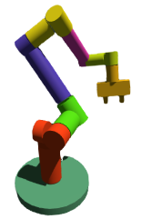
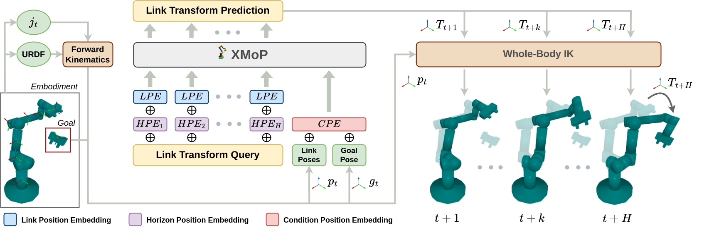

#  XMoP: Whole-Body Control Policy for Zero-shot Cross-Embodiment Neural Motion Planning


 <br>
<p align="center">
  <a href="https://prabinrath.github.io/xmop">[Project page]</a> •
  <a href="https://prabinrath.github.io/xmop/resources/paper.pdf">[Paper]</a> •
  <a href="https://huggingface.co/prabinrath/xmop">[Model]</a> •
  <a href="https://huggingface.co/datasets/prabinrath/xmop">[Data]</a>
</p>
<p align="center">
  <a href="https://prabinrath.github.io/">Prabin Kumar Rath</a><sup>1</sup>,
  <a href="https://nakulgopalan.github.io/">Nakul Gopalan</a><sup>1</sup> <br>
  <sup>1</sup>Arizona State University
</p>
XMoP is a novel configuration-space neural policy that solves motion planning problems zero-shot for unseen robotic manipulators, which has not been achieved by any prior robot learning algorithm. We formulate C-space control as a link-wise SE(3) pose transformation method, and showcase its scalability for data-driven policy learning. XMoP uses fully synthetic data to train models for motion planning and collision detection while demonstrating strong sim-to-real generalization with a 70% success rate. Our work demonstrates for the first time that C-space behavior cloning policies can be learned without embodiment bias and that these learned behaviors can be transferred to novel unseen embodiments in a zero-shot manner. This repository contains the implementation, data generation, and evaluation scripts for XMoP.

<div align="center">
  
</div>

## 🦾 Real-world rollouts
All rollouts shown below use XMoP with a fixed set of frozen policy parameters which was completely trained on synthetic (`robots and environments`) planning demonstration data.
<div align="center" style="max-width: 100%;margin: 0; padding: 0;">
  
</div>

## 🛠️ Installation
The system has been tested on Ubuntu 22.04 with Intel 19 12th Gen CPU, 64GB RAM, and NVIDIA RTX 3090 GPU.
### 1. Docker setup (recommended)
> Install docker

Install docker from this [tutorial](https://www.digitalocean.com/community/tutorials/how-to-install-and-use-docker-on-ubuntu-22-04).
Install `nvidia-container-toolkit` from this [tutorial](https://docs.nvidia.com/datacenter/cloud-native/container-toolkit/latest/install-guide.html).

> Download image

The docker image comes pre-installed with all required dependencies for data generation, training, inference, and benchmarking.
```
cd <xmop-root-directory>
bash xmop_dev_docker.sh
```
> Exit container
```
ctrl+d
```
### 2. Local setup
> System dependencies
```
sudo apt install -y libosmesa6-dev libgl1-mesa-glx libglfw3 \
liborocos-kdl-dev libkdl-parser-dev liburdfdom-dev libnlopt-dev libnlopt-cxx-dev \
git wget
```
> Setup conda env
```
conda create -n xmop_dev python=3.10.13
conda activate xmop_dev
cd <xmop-root-directory>
bash setup_xmop_conda_dev_env.sh
```
> OMPL (optional)
Ompl is required for data generation and baseline experiments. Install ompl with python bindings from [here](https://github.com/ompl/ompl).

## 🛝 Try it out!
> Download resources
```
bash download_resources.sh all
```
### 1. Run examples
```
conda activate xmop_dev
cd <xmop-root-directory>
```
For each of the following demos, you can change the value of `URDF_PATH` variable to run on different robots.
> Run XMoP planning demo
```
python examples/multistep_collisionfree_rollout.py
```
> Run XMoP-S reaching demo
```
python examples/singlestep_reaching_rollout.py
```
> Run XCoD collision detection demo
```
python examples/real_robot_collision_detection.py
```
> Run whole-body pose reconstruction with XCoD out-of-distribution demo
```
python examples/xmop_reconstruction_xcod_ood.py
```
> Run XCoD Ompl hybrid planning demo
```
python examples/ompl_xcod_hybrid_planning.py
```
### 2. Data generation
Data generation can be run on separate systems for consecutive fragments. Later they are merged to generate a unified dataset.
> Generate XMoP planning demonstration dataset
```
python data_gen/data_gen_planning.py --start_idx <start-idx> --end_idx <end-idx> --num_proc <number-of-cpus-to-use>
```
> Some problems might still remain unsolved, hence retry solving them
```
python data_gen/data_gen_retry_unsolved_planning.py --start_idx <start-idx> --end_idx <end-idx> --num_proc <number-of-cpus-to-use>
```
> Once planning demonstrations are generated, next generate collision detection dataset
```
python data_gen/data_gen_collision.py --start_idx <start-idx> --end_idx <end-idx> --num_proc <number-of-cpus-to-use>
```
### 3. Training
Use `-h` flag to see the parameters.
> Train XMoP diffusion policy
```
python train_xmop.py
```
> Train XMoP-S reaching policy
```
python train_xmop_s.py
```
> Train XCoD collision model
```
python train_xcod.py
```
## 🩹 Add a new manipulator
Coming soon!
## 🛝 Real-world deployment
Coming soon!
## 🏷️ License
This repository is released under the MIT license. See [LICENSE](LICENSE) for additional details.
## 🙏 Acknowledgement
[MpiNets](https://mpinets.github.io/) • [Diffusion Policy](https://diffusion-policy.cs.columbia.edu/) • [Diffusion Transformer](https://www.wpeebles.com/DiT)
